# Relatório de Engenharia Web - Base de Dados de Inquéritos de genere

# Autores 
- João Luis Ferreira Magalhães A100740
- Tiago Granja Rodrigues A100827
- Rodrigo Ferreira Gomes A100555

# Introdução
Este relatório surge no âmbito da Unidade Curricular de Engenharia Web, em que nos foi proposto a conceção de uma aplicação Web.

A proposta de enunciado escolhida pelo grupo foi a criação de uma aplicação Web de gestão de inquéritos de genere (proposta nº2).

# Contexto
Este projeto foca na ingestão e organização de um dataset histórico, que documenta os processos de ordenação de párocos e justificações de fraternidade. Os registos incluem requerimentos, inquirições de genere, e documentos relacionados como cartas de comissão e declarações de párocos. Destaca-se a importância dos dados genealógicos para estabelecer relações entre registos sempre que possível.

Além de estruturar os dados no MongoDB, o projeto envolve o desenvolvimento de uma interface web para navegação por índices antroponímicos (nome), toponímicos (lugar) e cronológicos (data). A plataforma permitirá adicionar novos registos, editar informações e interagir através de posts e comentários sobre os registos, bem como realizar sugestões de alteração.

O objetivo não é apenas preservar os documentos históricos, mas também enriquecer a compreensão da história eclesiástica e genealógica associada às ordenações e justificações de fraternidade ao longo do tempo.

# Objetivos
- Analisar o dataset fornecido e tratá-lo para para ser carregado no MongoDB.
- Dar atenção especial ao campo “Scope and Content”, com foco em materializar dados de relações genealógicas entre registos.
- Criar uma interface web para navegação nos registos, com especial ênfase na navegação através das relações entre registos.
- Permitir a adição de novos registos.
- Possibilitar a navegação por nome (índice antroponímico), lugar (índice toponímico) e data (índice cronológico), páginas e ordenação por data e nome.
- Permitir que usuários editem informações de um registo, incluindo a adição de novas relações entre registos.
- Permitir que usuários façam posts sobre um registo.
- Permitir que outros usuários comentem nos posts.
- Permitir a sugestão de alterações a registos.
- Possibilitar o download de inquirições
- Registar utilizadores
- Manter o estado da aplicação (importação e exportação de dados)
  
# Arquitetura 
Em termos de arquitetura temos na imagem seguinte os diferentes módulos utilizados, bem como as suas comunicações para que a perceção do trabalho seja mais intuitiva.

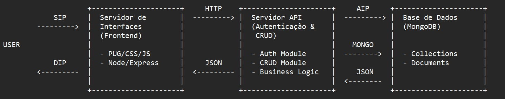

# Tratamento do dataset
O dataset fornecido foi submetido a um tratamento antes de ser inserido na base de dados, tanto por haver informações irrelevantes aos nossos objetivos, bem como tambem para aumentar o seu conhecimento através de relações criadas.

- Remoção do primeiro registo do dataframe. Esta operação foi realizada porque o primeiro registo era um exemplo.
- Seleção das seguintes colunas, que o grupo achou mais relevantes para o problema : `_id`, `UnitTitle`, `UnitDateInitial`, `UnitDateFinal`, `UnitDateInitialCertainty`, `UnitDateFinalCertainty`, `Repository`, `ScopeContent`, `Creator`, `Created`, `RelatedMaterial`, `PhysTech`, `PhysLoc`, `PreviousLoc`, e `LangMaterial`. 
- Todos os valores ausentes `NaN` foram substituídos por strings vazias (""). 
- Conversão das datas de `YYYY-MM-DD` para `DD-MM-YYYY`. Isso facilita o entendimento das datas no formato desejado, bem como a compatibilidade com formulários.
- Extração da localidade do campo ScopeContent a utilizar em futuros filtros de pesquisa.
- Extração dos nomes do campo `UnitTitle` e substituição deste campo por `Nome`.
- Extração de informações de filiação do campo ScopeContent, identificando e separando os nomes de pais.
- Através do campo RelatedMaterial, foram extraídas as relações e estruturadas conforme o padrão especificado, sempre que possível.

# API de dados (Porta 7777)
A API de dados da nossa aplicação foi implementada como um serviço isolado que possibilita a comunicação entre o servidor de interface e a base de dados.

## Base de dados
A base de dados da nossa aplicação foi construída num sistema de gestão de bases de dados NoSQL orientado a documentos, o MongoDB.

A base de dados possui três coleções: inquiricoes, suggestions, users.

A colecção inquiricoes é a principal colecção da aplicação. Esta colecção está envolvida na maioria das funcionalidades e interacções que os utilizadores podem fazer, uma vez que é onde estão armazenados todas as inquirições do sistema.

A coleção suggestions foi criada para armazenar propostas de alteração nos registos das inquirição. Estas sugestões são fundamentais para a melhoria contínua da precisão e completude dos dados, permitindo aos utilizadores contribuírem com correções ou adições relevantes. Cada sugestão inclui informações como nome, datas de produção inicial e final, verificação das datas, repositório, conteúdo, localidade, localizações físicas antiga e atual, características técnicas, inquirições relacionadas e idioma do material. Esses dados facilitam o processo de revisão e atualização dos registos, garantindo um acervo robusto e preciso ao longo do tempo.

A colecção users é responsável por armazenar as informações dos utilizadores, desde a informação de autenticação, nivel de privilégio, estado de atividade, a data de criação e a data em que foi acedido pela ultima vez.

## Módulo de Autenticação
A autenticação é tratada pelo Passport com a estratégia local (LocalStrategy), que usa o nome do utilizador e senha para os autenticar.

A sessão é gerida pelo express-session, que usa cookies para identificar sessões de utilizador. A chave secreta (secret) é crucial para a segurança dos cookies de sessão.

## Rotas da API

### Rotas inquiricoes:
- `GET /inquiricoes`: Devolve todas as inquiricoes com base em filtros como (nome, localidade, datas) e ordenações (nome e data).
- `POST /inquiricoes`: Adiciona uma nova inquirição.
- `GET /inquiricoes/:id`: Devolve uma inquirição tendo em conta o seu *id*.
- `PUT /inquiricoes/:id`: Atualiza uma inquirição tendo em conta o seu *id*. Verifica se o utilizador tem permissões para tal.
- `DELETE /inquiricoes/:id`: Elimina uma inquirição tendo em conta o seu *id*. Verifica se o utilizador tem permissões para tal.
- `GET /inquiricoes/:id/suggestions`: Devolve uma lista de todas as sugestões **pendentes** de uma inquirição, tendo em conta o seu *id*.
- `GET /inquiricoes/suggestion/:id`: Devolve uma sugestão tendo em conta o seu *id*.
- `PUT /inquiricoes/suggestion/:id/status`: Atualiza o estado de uma sugestão tendo em conta o seu *id*. Se o *status* for **accepted** a Inquirição associada à sugestão é atualizada com os campos da Sugestão e o *status* da Sugestão é atualizado para **accepted**. Se o *status* for **rejected** o *status* da Sugestão é atualizado para **rejected** e a Inquirição não é alterada.
- `POST /inquiricoes/:id/suggest`: Cria uma nova Sugestão para uma Inquirição tendo em conta o *id* da Inquirição.
- `POST /inquiricoes/:idInquiricao/posts`: Adiciona um novo post a uma inquirição tendo em conta o *id* da Inquirição.
- `POST /inquiricoes/post/:postID/comments`: Adiciona um comentário a um post tendo em conta o *id* do post.
- `GET /inquiricoes//posts/:postId/comments`: Devolve todos os comentários de um post tendo em conta o *id* do post.

Para alguma rotas, como é o caso das rotas para editar, remover e ver uma sugestão de uma Inquiricao, é verificado se o utilizador é um admin ou é o criador da inquirição antes de permiter o acesso as rotas

### Rotas users:
- `POST /users/register`: Adiciona um novo utilizador
- `POST /users/login`: Realiza o login de um utilizador
- `GET /users/profile`: Devolve os dados do utilizador autenticado
- `PUT /users/profile`: Atualiza os dados do utilizador autenticado

# Interface (Porta 7778)
A Interface da nossa aplicação foi implementada como um serviço isolado que possibilita a comunicação entre o utilizador da interface e os restantes serviços.

## Rotas da Interface

### Rotas inquiricoes:
- `GET /inquiricoes`: Lista as inquirições disponíveis com base nos filtros passados pelo utilizador.
- `GET /inquiricoes/myInquiricoes`: Lista as inquirições criadas pelo utilizador autenticado com base nos filtris.
- `GET /inquiricoes/delete/:id`: Rota para excluir uma inquirição específica, identificada pelo id. (Só o admin e o criador da inquirição conseguem remover a inquirição)
- `POST /inquiricoes/edit/:id`: Rota para atualizar uma inquirição específica, identificada pelo id. (Só o admin e o dono da inquirição conseguem editar)
- `GET /inquiricoes/edit/:id`: Rota para exibir o formulário de edição de uma inquirição específica, identificada pelo id.
- `POST /inquiricoes/add`: Rota para adicionar uma nova inquirição.
- `GET /inquiricoes/add`: Rota para exibir o formulário de adição de nova inquirição.
- `GET /inquiricoes/database`: Rota para exibir a página para gerir a base de dados, apenas acessível a utilizadores com nível `admin`.
- `POST /inquiricoes/database/import`: Rota para importar dados para a base de dados.
- `POST /inquiricoes/database/export`: Rota para exportar dados da base de dados.
- `GET /inquiricoes/upload`: Rota para exibir a página de dar upload de um ficheiro.
- `POST /inquiricoes/upload`: Rota para fazer upload de um ficheiro.
- `GET /inquiricoes/:id`: Rota para exibir os detalhes de uma inquirição específica, identificada pelo id.
- `GET /inquiricoes/:id/pdf`: Rota para gerar um arquivo PDF dos detalhes de uma inquirição específica, identificada pelo id.
- `GET /inquirioes/:id/suggest`: Rota para exibir o formulário de sugestão de alteração sobre uma inquirição específica, identificada pelo id.
- `GET /inquiricoes/:id/suggest/confirm`: Rota para exibir uma página de confirmação, após enviar uma sugestão sobre uma inquirição.
- `POST /inquiricoes/:id/suggest`: Rota para enviar uma sugestão sobre uma inquirição específica, identificada pelo id.
- `GET /inquiricoes/:id/suggestions`: Rota para listar todas as sugestões feitas sobre uma inquirição específica, identificada pelo id.
- `POST /inquiricoes/suggestion/:id/status`: Rota para atualizar o status de uma sugestão específica, identificada pelo id.
- `GET /inquiricoes//:id/addPost` : Rota para exibir a página para escrever o Post numa inquirição.
- `POST /inquiricoes/:id/addPost`: Rota para adicionar um Post a uma inqurição, o username de quem fez o Post é dado pelo username do utilizador logado.
- `GET /inquiricoes/:id/posts`: Rota para exibir todos os Posts feitos numa dada Inquirição.
- `GET /inquiricoes/posts/:postId`: Rota para exibir os comentários de um post.
- `GET /inquiricoes/posts/:postId/comments`: Rota para adicionar um comentário a um post.

### Rotas user
- `GET /`: Rota principal que redireciona para `/inquiricoes` se o utilizador estiver autenticado (possuir token válido no cookie), caso contrário, redireciona para `/login`.
- `GET /login`: Rota para exibir o formulário de login (login.js).
- `GET /register`: Rota para exibir o formulário de registo de novo usuário (signUp.js).
- `POST /login`: Rota para processar o login do utilizador.
- `POST /register`: Rota para processar o registo de um novo utilizador.
- `GET /logout`: Rota para realizar o logout do utilizador.
- `GET /profile`: Rota para exibir o perfil do utilizador.
- `GET /profile/edit`: Rota para exibir o formulário de edição do perfil do utilizador.
- `POST /profile/edit`: Rota para processar a atualização do perfil do utilizador.

## Páginas Interface

## Registo de conta
Na página de criação da conta, a aplicação solicita ao utilizador algumas informações para a criação da conta (nome de utilizador, nome, username e password).

No momento em que o utilizador confirma a criação da conta, o sistema verifica se já existe algum utilizador com o username mencionado no formulário. Se essa situação ocorrer, a conta não é criada e a aplicação informa o utilizador dessa ocorrência.

  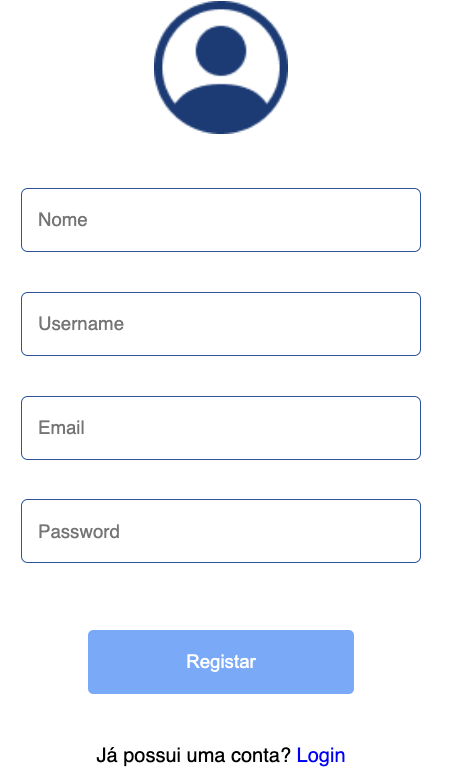

## Inicio de Sessão
Na página de login, a aplicação solicita ao utilizador o seu username e a sua palavra-passe. Se o username não existir ou a palavra-passe não coincidir, a aplicação informa o utilizador dessa ocorrência e impede o acesso.

  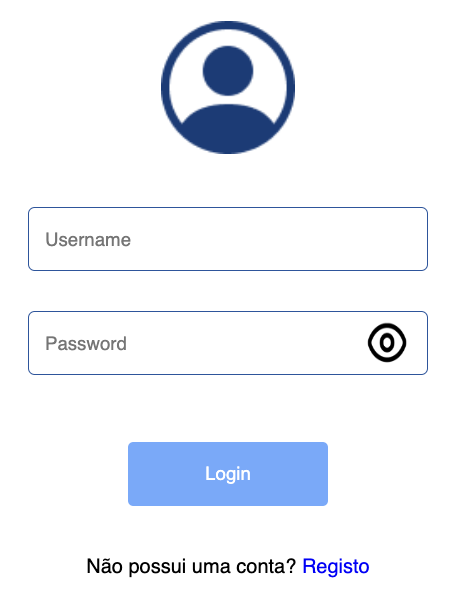

## Perfil
Na página de perfil da nossa aplicação o utilizador consegue ver e editar algumas informações relativas à conta onde está autenticado.

O utilizador consegue ver o seu Username, Nome e Email.

Os campos Nome e Email são editáveis permitindo que o utilizador altere os seus dados.

  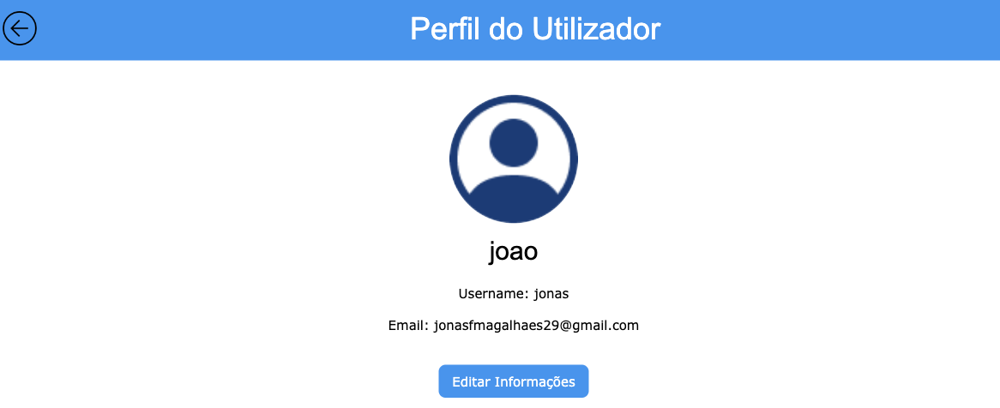

## Pesquisa
Na página principal da aplicação, será disponibilizado ao utilizador um formulário de pesquisa (figura abaixo) onde ele pode pesquisar os inquéritos através de diversos campos (Nome, localidade, Data inicial e final) e ordenar (Nome e Data).

  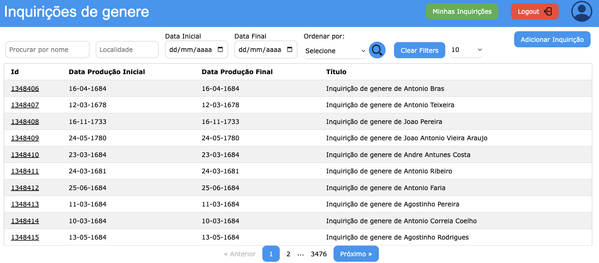

Após o utilizador especificar os critérios de pesquisa, o utilizador será encaminhado para uma página que apresenta os resultados dessa pesquisa (figura abaixo).
  
  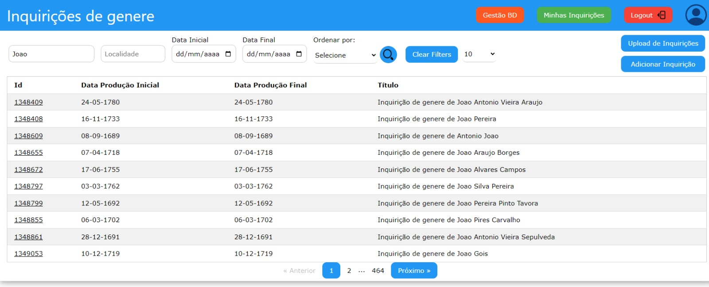

Se o utilizador optar por visitar um inquérito, o sistema reencaminhá-lo-á para uma página com a informação completa do inquérito seleccionado.

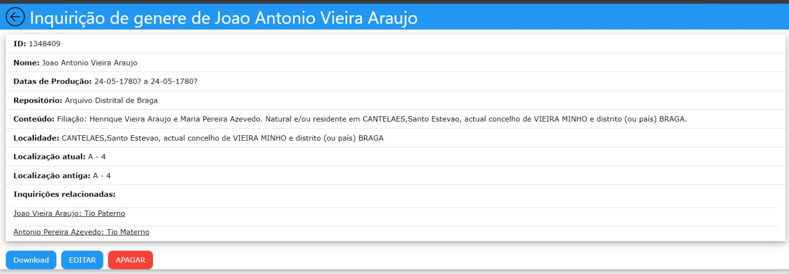

## Post
Relativamente a cada inquérito ser-lhe-á possivel adicionar `posts` ao inquérito selecionado onde o mesmo poderá ser comentando por outros utilizadores do sistema que o desejem fazer.
Cada `post` apresenta a seguinte estrutura:

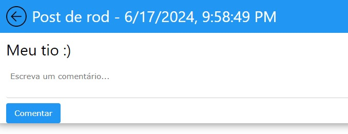

Os comentário serão disponibilizados da seguinte forma:

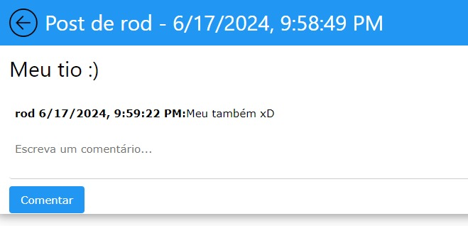

## Sugestão
Na página principal, ao carregar no botão de sugestão irá-lo-á reenchaminhar para um formulário onde poderá preencher algumas informações tal como apresentado na imagem seguinte

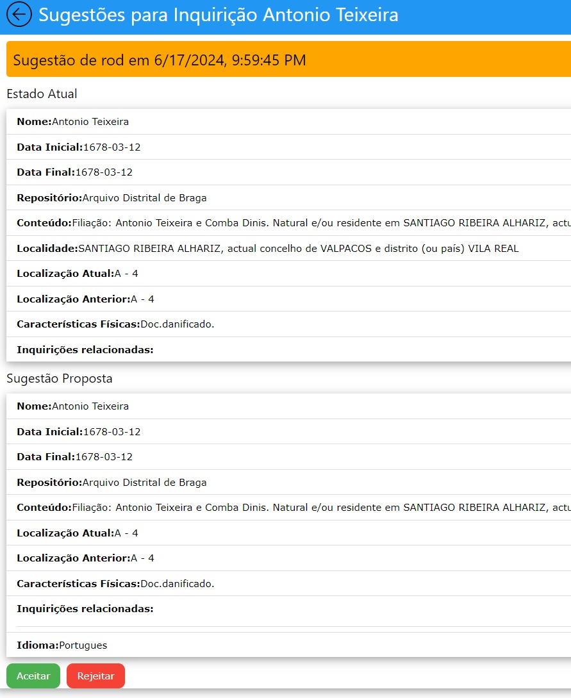

## Adição de inquéritos
A funcionalidade de adicionar inquéritos, permite submeter inquéritos de duas maneiras diferentes, manualmente ou através de um ficheiro. Tal pode ser feito através dos botões respetivos.

## Adição manual
Para a adição manual, é apresentado ao administrador a seguinte página.

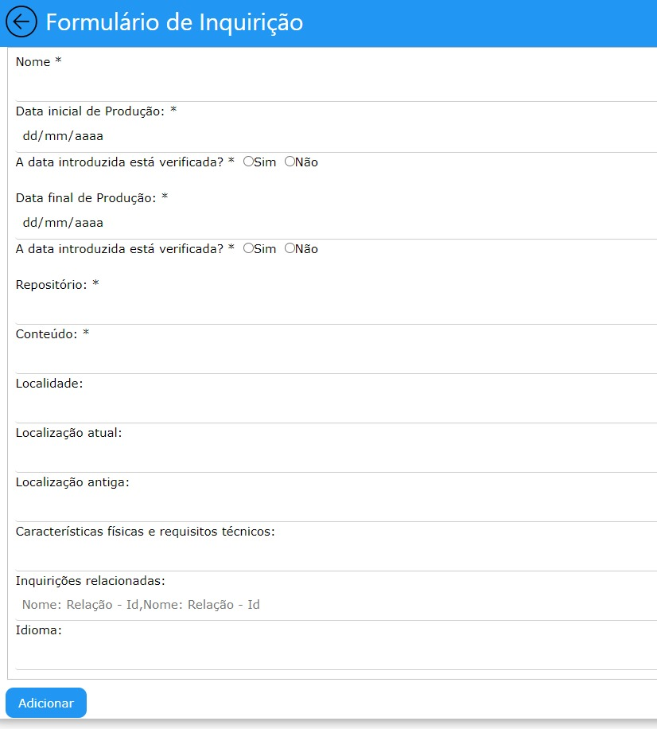

## Adição por ficheiro
Para a adição por ficheiro, é apresentada a seguinte página.

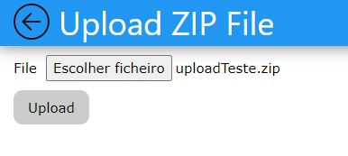

## Download por ficheiro
Para realizar o download de um inquérito basta apenas carregar num botão e um pdf será descarregado para a máquina do utilizador com as informações do inquérito em questão.

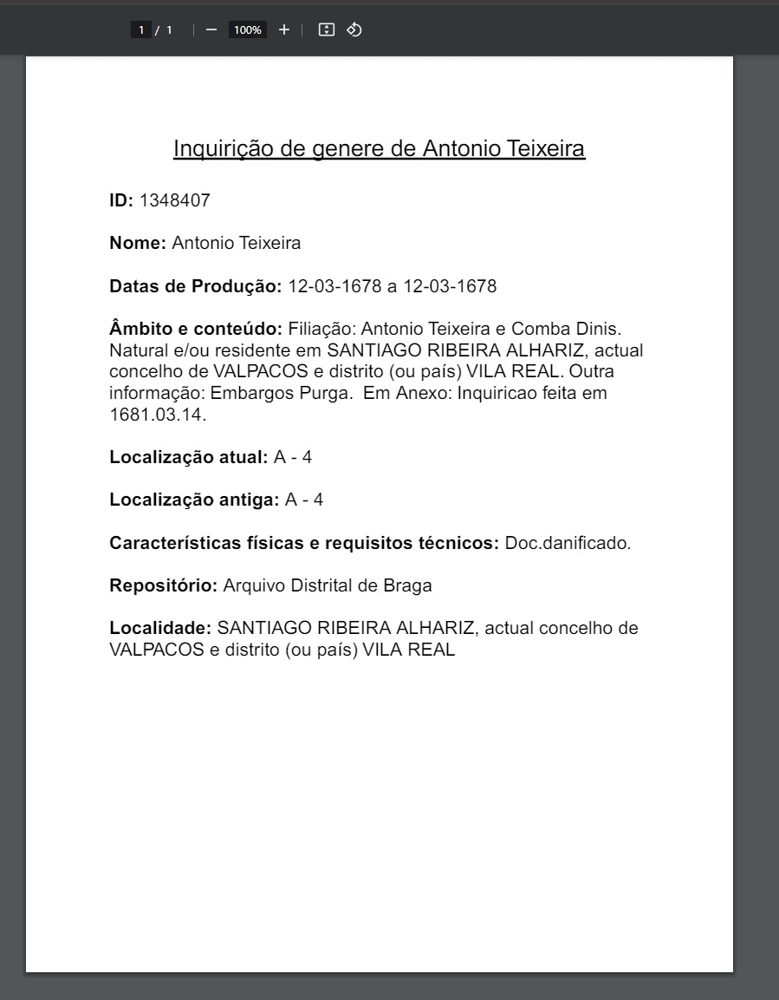

## Editar/Remover Inquérito
Os administradores têm a capacidade de editar e remover inquéritos já existentes no sistema.

Nesta página os administradores poderão editar qualquer campo do inquérito, com a exceção do seu ID, ou adicionar novos campos ao inquérito. Para confirmar as alterações poderá clicar no botão "Confirmar alterações" e as suas alterações serão guardadas no sistema.

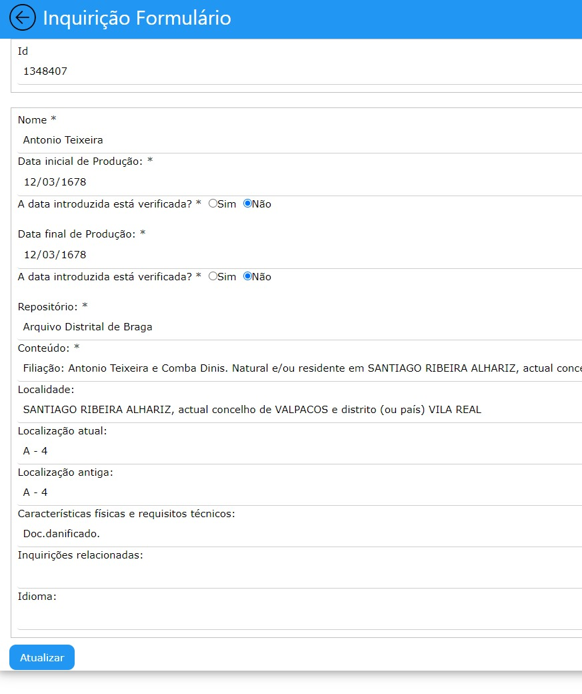

Para a remoção é necessário apenas clicar no botão "Remover" e o mesmo é apaga da base de dados aparecendo uma mensagem de confirmação da ação.

# Base de dados
Para a realização de backups da base de dados e para a obteção das informações das diferentes coleções da base de dados temos os seguintes botões:

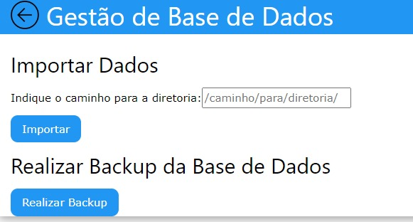

# Conclusão
Dada por concluída a realização do trabalho prático, podemos dizer que este projeto nos ajudou a consolidar o conhecimento obtido através das aulas de Engenharia Web e a explorar um pouco mais do desenvolvimento de aplicações Web.

O projeto também nos incentivou a resolver problemas reais de gestão de utilizadores e a ter um design estético e de fácil compreensão. Implementamos também funcionalidades relativas a facilidade de interação como a paginação na procura dos inquéritos, caixas de confirmação de ações e prevenção de erros. Todas essas funcionalidades foram implementadas com o utilizador final em mente (tanto normal como admin) e achamos que fizemos um bom trabalho nesse aspeto.

Como trabalho futuro, há sempre possibilidade para expandir o conjunto de features que a aplicação oferece, bem como uma maior dedicação no embelezamento das várias páginas do site e modularização do código. Através do feedback de utilizadores concretos da nossa aplicação, seríamos capazes de direcionar o nosso foco para aperfeiçoar funcionalidades de acordo com as suas necessidades específicas, bem como a implementação de novas funcionalidades desejadas pelos nossos futuros utilizadores.

# Anexo
## SETUP

Para correr a nossa aplicação em docker basta correr:
- `docker-compose up --build -d`
